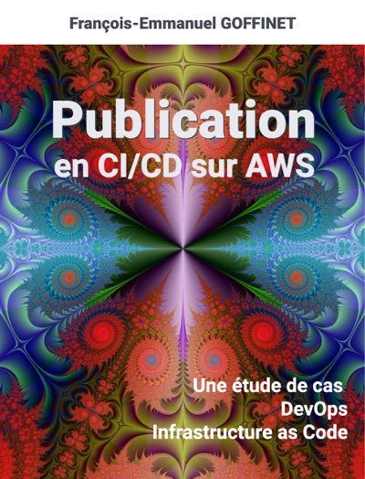

# Projet de publication en CI/CD sur AWS

Auteur : {{ book.author }}

Date de fabrication : {{ gitbook.time }}

* [PDF](/ebooks/gitbook-gitlab.pdf)
* [EPUB](/ebooks/gitbook-gitlab.epub)
* [MOBI](/ebooks/gitbook-gitlab.mobi)

Ce document est publié avec la méthode qu'il décrit. Il poursuit uniquement un but éducatif.

Sources du projet : [https://gitlab.com/goffinet/gitbook-gitlab/](https://gitlab.com/goffinet/gitbook-gitlab/)

---

<!-- toc -->

## 1. Objectifs du document et résultat attendu

Ce document a pour objectif premier de fournir un énoncé dans le cadre d'une étude de cas DevOps qui met en oeuvre des outils d'intégration continue à partir d'une infrastructure Amazon Web Services AWS.

Les illustrations proposées sont à :

* évaluer
* adapter
* améliorer

Le résultat attendu est le suivant : fournir une solution sous forme de code informatique (repo git) avec une documentation la plus complète.

La méthode de travail est celle qui devrait le mieux correspondre aux principes DevOps.

Ce document d'énoncé n'a pas pour objectif de fournir une solution aboutie. Il pourrait toutefois évoluer dans cette direction.

## 2. Scénario et énoncé

Scénario : CI /CD avec Git, Gitlab, sur AWS EC2, Hébergement d'un site Web statique sur AWS S3 en CDN et en HTTPS.

Générer un livre numérique (ebook) en différents formats (HTML, PDF, MOBI, EPUB) en _intégration continue_ et _en livraison continue_ à partir d'un contenu écrit en Markdown sur une infrastructure dans le nuage. Le résultat attendu est la livraison continue du document sur un site Web aux normes actuelles (IPv6, HTTPS et CDN) offrant les différents formats de lecture. La solution est fournie sous forme de code. Le résultat est évaluer sur base d'une vision défendue de la culture DevOps.

Les tâches "Dev" participent à la fabrication du produit. Les tâches "Ops" visent à délivrer le produit fini et à maintenir l'infrastructure nécessaire à la chaîne de production.

Il est demandé de développer la proposition de base en la testant, en la corrigeant, en la discutant, en ajoutant des étapes de retour dans les processus.

On trouvera dans ce document des points de départs et des outils à évaluer, à adapter et à améliorer.

* Hébergement du code source : git
* Application : Gitbook-cli Toolchain
* Pipeline : Gitlab-ci
  * avec des noeuds d'exécution gitlab-runner (Docker)
* Hébergement Web :
  * AWS IAM
  * AWS S3,
  * AWS Route53,
  * AWS Cloudfront,
  * AWS Certificate Manager (ACM)
* Infrastructure as Code
  * Bash
  * Python
  * Ansible
  * Terraform
  * Cloudformation

## 3. Modèles et références

* [Gitbook.com Legacy](https://legacy.gitbook.com/) et [Calibre](https://calibre-ebook.com/)
* [Softcover](https://www.softcover.io/)
* [Netlify](https://www.netlify.com/features/) : _Build, deploy, and manage modern web projects. An all-in-one workflow that combines global deployment, continuous integration, and automatic HTTPS. And that’s just the beginning._

### 3.1. Autres références dans ce cadre

* [Pandoc](https://pandoc.org/), un convertisseur open-source
* [Book publishing toolchain based on AsciiDoc](https://github.com/jd/asciidoc-book-toolchain)
* [Latex](https://www.latex-project.org/)
* [Jekyll](https://jekyllrb.com/)
* [MkDocs-Material](https://squidfunk.github.io/mkdocs-material/)
* [Hugo](https://gohugo.io/)

### 3.2. Autres Frameworks de publication

* [Wordpress](https://wordpress.org/)
* [Drupal](https://www.drupal.org/)
* [Plone](https://plone.org/)
* [Ghost](https://ghost.org/)

## 4. Principes DevOps

Les trois voies (ou manières) décrivent les valeurs et les philosophies qui encadrent les processus, les procédures, les pratiques de DevOps, ainsi que les étapes normatives.

1. Le premier concerne le flux de travail de gauche à droite, du développement aux opérations informatiques.
2. Le second concerne le flux constant de retours rapides de droite à gauche à toutes les étapes du flux de valeur.
3. La troisième méthode consiste à créer une culture qui favorise deux choses : l'expérimentation continue et la compréhension du fait que la répétition et la pratique sont les conditions préalables à la maîtrise.

### 4.1. La Première Voie

>La première méthode met l'accent sur le rendement de l'ensemble du système, par opposition au rendement d'un silo de travail ou d'un service particulier - qui peut être aussi important qu'une division (p. ex., Développement ou Opérations de TI) ou aussi petit qu'un contributeur individuel (p. ex., un développeur, un administrateur système).
>
>L'accent est mis sur tous les flux de valeur de l'entreprise qui sont rendus possibles par les IT. En d'autres termes, cela commence lorsque les besoins sont identifiés (par l'entreprise ou le service informatique, par exemple), sont intégrés dans le développement, puis transférés dans les opérations informatiques, où la valeur est ensuite fournie au client sous la forme d'un service.
>
>Les résultats de la mise en pratique de la Première Voie comprennent le fait de ne jamais transmettre un défaut connu aux centres de travail en aval, de ne jamais permettre à l'optimisation locale de créer une dégradation globale, de toujours chercher à augmenter le débit et de toujours chercher à obtenir une compréhension profonde du système (selon Deming).

### 4.2. La Seconde Voie

>La deuxième méthode consiste à créer des boucles de rétroaction de droite à gauche. L'objectif de presque toutes les initiatives d'amélioration des processus est de raccourcir et d'amplifier les boucles de rétroaction afin que les corrections nécessaires puissent être apportées continuellement.
>
>Les résultats de la deuxième voie comprennent la compréhension et la réponse à tous les clients, internes et externes, la réduction et l'amplification de toutes les boucles de rétroaction et l'intégration des connaissances là où on en a besoin.

### 4.3. La Troisième Voie

>La troisième voie consiste à créer une culture qui favorise deux choses : l'expérimentation continue, la prise de risques et l'apprentissage de l'échec d'une part, et la compréhension que la répétition et la pratique sont les conditions préalables à la maîtrise d'autre part.
>
>Nous avons besoin de ces deux éléments de la même façon. L'expérimentation et la prise de risques sont les garants de la volonté d'amélioration continue, même si cela signifie aller plus loin dans la zone dangereuse que on ne l'a jamais fait. Et on doit maîtriser les compétences qui peuvent aider à sortir de la zone dangereuse lorsque on est allé trop loin.
>
>Les résultats de la troisième voie comprennent le temps alloué pour l'amélioration du travail quotidien, la création de rituels qui récompensent l'équipe pour avoir pris des risques et l'introduction de failles dans le système pour accroître la résilience.

Source : [The Three Ways: The Principles Underpinning DevOps](https://itrevolution.com/the-three-ways-principles-underpinning-devops/)

### 4.4. Culture DevOps

* [Elements Of The First Way: And The DevOps Implications…](https://itrevolution.com/elements-of-the-first-way-and-the-devops-implications/)
* [DevOps Culture (Part 1)](https://itrevolution.com/devops-culture-part-1/)
* [DevOps Culture (Part 2)](https://itrevolution.com/devops-culture-part-2/)

## 5. Dev vers Ops en pipeline CI/CD

Dev = Application, frameworks, stack, toolchain

Outil | Fournisseur | Alternatives
--- | --- | ---
Application Toolchain | **Gitbook-cli** (_basé NPM_), calibre | ...
Source Control Management | **Git**, **Gitlab** | Github, Gitlab Hosted (AWS), AWS CodeCommit, ...
CI / CD Tool | **Gitlab-ci**, **Gitlab-runner** | Jenkins, AWS CodePipeline, AWS CodeDeploy, Bitbucket
Container Repository | **Gitlab Hub** | Docker Hub,
Test | versions, **markdown-lint**, **npm** (gitbook), **pip** (aws-cli) | ...
Deploy  | **aws-cli s3**  | Python API, aws-cli, openstack-cli, Ansible, ...

## 8. Ops vers Dev en IaC sur AWS

Ops = Infrastructure

* Hébergement
* Noeuds d'exécution

Service | Fournisseur | Alternatives
--- | --- | ---
Name Registry  | AWS Registrar  |  OVH, Gandi
DNS | AWS Route53 | Cloudflare, OVH
TLS / HTTPS | AWS Certificate Manager | Let's Encrypt
CDN | Cloudfront | Cloudflare, OVH
Hosting / Storage | AWS S3 | ...
Build Node | AWS EC2 Gitlab-runner hosted | OVH, Scaleway, Azure, GCP, ...

## 6. Méthodes de configuration de l'infrastructure

* Manuelle dans la console
* Manuelle ou scriptée avec aws-cli
* En python avec le module Boto
* Ansible
* Cloudformation
* Terraform
