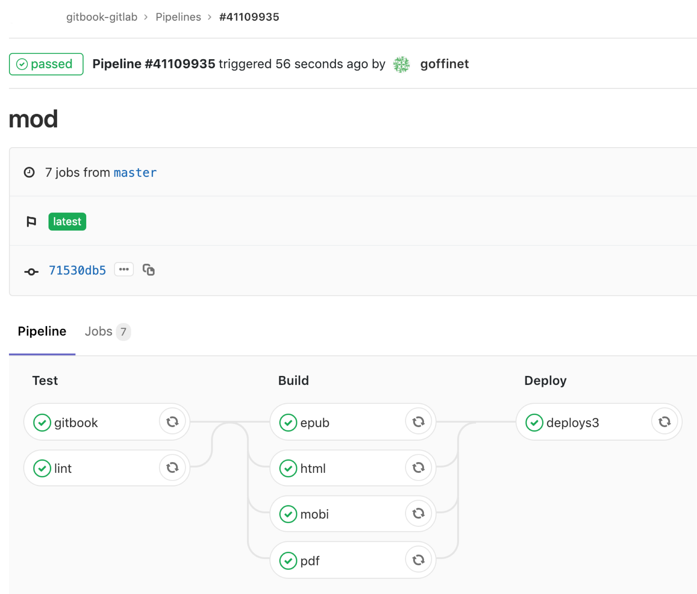

# Introduction

Auteur : {{ gitbook.author }}

Date de fabrication : {{ gitbook.time }}

* [PDF](ebooks/gitbook-gitlab.pdf)
* [EPUB](ebooks/gitbook-gitlab.epub)
* [MOBI](ebooks/gitbook-gitlab.mobi)

## Projet CI/CD de publication

* Scénario : Hébergement d'un site Web statique sur AWS
* Application : Gitbook-cli Toolchain
* Pipeline : Gitlab-ci
  * avec un gitlab-runner

### Scénario :  Hébergement d'un site Web statique sur AWS

Basé sur le White Paper ["Hosting Static Websites on AWS"](https://aws.amazon.com/fr/getting-started/projects/host-static-website/)

* Stockage / hébergement : AWS S3
* DNS : AWS Route 53
* CDN / Logging : AWS Cloudfront
* Gitlab-Runner : AWS EC2
* CI / CD : Gitlab
* Repo mgmt : Gitlab
* Advertisements : Slack
* Docker registry : Gitlab

### Application : Gitbook-cli Toolchain

https://toolchain.gitbook.com/

### Pipeline : Gitlab-ci

### Apprivionnement du Gitlab-runner
